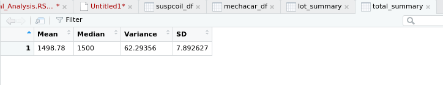
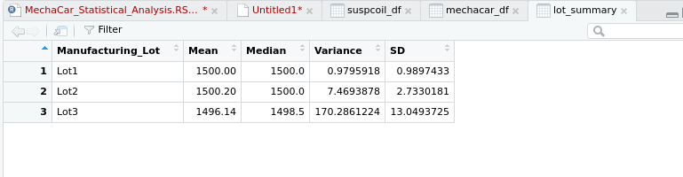

# MechaCar StatisticalAnalysis


## Overview

This project is to use Linear Regression to **predict the MPG (miles per gallon) for a vehicle**.

- The non-random Variance was based on the vehicles: _weight_, _spoiler angle_ and if the vehicle is equiped with _AWD (all wheel drive)_. 
- The maximum random variance was provided by the vehicle's _ground_clearance_ and _vehicle_length_.

## Resources
* Data Sources: MechaCar_mpg.csv, Suspension_Coil.csv
* Software: R, Python 3.7

## GitHub Application Link
<a href="https://jillibus.github.io/MechaCar_Statistical_Analysis/">MechaCar Statistical Analysis</a>

## RESULTS

- Since p-value ended up being less than zero (5.35e-11), the slope is not equal to zero.
- The R squared value is 71.49%, which implies that roughly 72% of the time, the predictions will be correct using this linear model.

```
Call:
lm(formula = mpg ~ vehicle_length + vehicle_weight + spoiler_angle + 
    ground_clearance + AWD, data = mechacar_df)

Coefficients:
     (Intercept)    vehicle_length    vehicle_weight     spoiler_angle  ground_clearance               AWD  
      -1.040e+02         6.267e+00         1.245e-03         6.877e-02         3.546e+00        -3.411e+00  
      
      
> # Generate summary statistics
> summary(lm(mpg ~ vehicle_length + vehicle_weight + spoiler_angle + ground_clearance + AWD, data = mechacar_df))

Call:
lm(formula = mpg ~ vehicle_length + vehicle_weight + spoiler_angle + 
    ground_clearance + AWD, data = mechacar_df)

Residuals:
     Min       1Q   Median       3Q      Max 
-19.4701  -4.4994  -0.0692   5.4433  18.5849 

Coefficients:
                   Estimate Std. Error t value Pr(>|t|)    
(Intercept)      -1.040e+02  1.585e+01  -6.559 5.08e-08 ***
vehicle_length    6.267e+00  6.553e-01   9.563 2.60e-12 ***
vehicle_weight    1.245e-03  6.890e-04   1.807   0.0776 .  
spoiler_angle     6.877e-02  6.653e-02   1.034   0.3069    
ground_clearance  3.546e+00  5.412e-01   6.551 5.21e-08 ***
AWD              -3.411e+00  2.535e+00  -1.346   0.1852    
---
Signif. codes:  0 ‘***’ 0.001 ‘**’ 0.01 ‘*’ 0.05 ‘.’ 0.1 ‘ ’ 1

Residual standard error: 8.774 on 44 degrees of freedom
Multiple R-squared:  0.7149,	Adjusted R-squared:  0.6825 
F-statistic: 22.07 on 5 and 44 DF,  p-value: 5.35e-11

```

## Looking at the Suspension Coils 
As we did with the MechaCar_mpg.csv, we read in the Suspension_Coil.csv into a DataFrame. This made it very easy for us to calculate the statistics on the coils sorting out the PSI.

Our first test was run against the Total DataFrame (data set) and the results were as follows:
```
> # Calculate statistics (mean, median, variance, std deviation of Susp Coil's PSI)
> Mean = mean(suspcoil_df$PSI)
> Median = median(suspcoil_df$PSI)
> Variance= var(suspcoil_df$PSI)
> SD = sd(suspcoil_df$PSI)
> # Calculate Total Summary Data Frame
> total_summary <- data.frame(Mean, Median, Variance, SD)
```


---

Our second run was to separate the total_summary by the Lot#
```
> # Summary by lot
> lot_summary <- suspcoil_df %>% group_by(Manufacturing_Lot) %>% summarize(Mean=mean(PSI), Median=median(PSI), Variance=var(PSI), SD=sd(PSI), .groups='keep')
```      


---

## Summary

The data shows high activity of The CityBike bike-sharing service in the New York Manhattan downtown area.  This area is a high traffic, business as well as tourist area, that is difficult to find parking as well as known for heavy traffic and expensive parking lots.  The data shows that early morning and afternoon business workers are using the CityBike ride-sharing as an alternative to other forms of Public Transportation to arrive and depart from their place of business.  With trends of a more casual workplace, in which Female workers would be able to wear pants and/or pantsuits, and more access to a changing facility, I can forsee an increase of additional female workers joining this form of Public Transportation.

Additional analysis that would be beneficial would be:
  * The number of downtown gyms or buildings with gyms and changing rooms for commuters.
  * The analysis of the different months throughout the year and temperatures to see how the number of rides differed.

Thank you for your time, and let me know if you wish to see any additional data.

Jill Hughes
